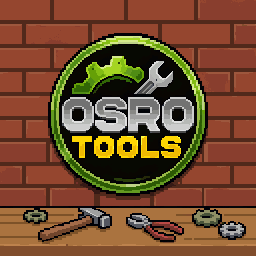

# OSRO Tools Documentation

Welcome to the OSRO Tools documentation. OSRO Tools is a fast, modern automation assistant for Ragnarok Online. It helps you automate repetitive tasks (like using potions, spamming skills, and keeping buffs active) so you can focus on playing the game.

## Table of Contents

### Introduction
* [Getting Started](getting-started.md)
* [Troubleshooting](troubleshooting.md)

### Features & Tabs
* [Skill Spammer](tabs/skill-spammer.md)
* [Skill Timer](tabs/skill-timer.md)
* [Autopot (HP/SP)](tabs/autopot.md)
* [Autobuff (Skills & Items)](tabs/autobuff.md)
* [Songs](tabs/songs.md)
* [Macro Switch](tabs/macro-switch.md)
* [ATK x DEF](tabs/atk-def.md)
* [Debuffs & Status Recovery](tabs/debuffs.md)
* [Misc (Transfer Helper, etc.)](tabs/misc.md)
* [Auto Off](tabs/auto-off.md)
* [Profiles](tabs/profiles.md)
* [Settings](tabs/settings.md)
