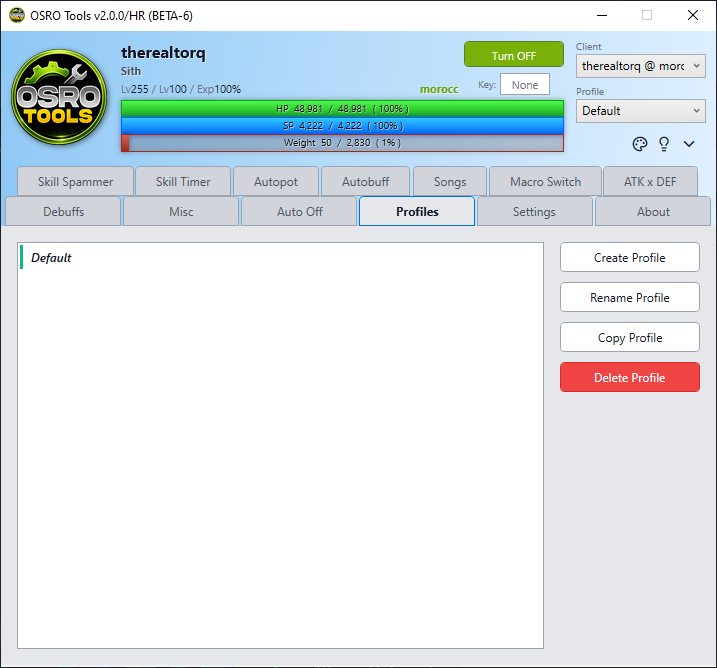

# Getting Started

Welcome to OSRO Tools! This guide will help you understand the basics and set up the app for the first time.

## 1. Running the App
OSRO Tools requires Administrator privileges to work properly.
* **Why?** The app must read the game's memory to know your character's exact HP, SP, and active buffs. It also needs to send keyboard presses directly to the game window. Windows security blocks these actions otherwise.
* **How to do it:** Just double-click the OSRO Tools executable (`ORTools.exe`). Windows will automatically show a UAC prompt asking for permission. Click **Yes**.

> **Note:** If your HP and SP display `0 / 0` while logged into the game, you may have clicked No on the prompt. See the [Troubleshooting](troubleshooting.md) guide for help.

## 2. The Main Interface
When you open OSRO Tools, you will see a top bar and a Tab Bar.
1. **Top Bar:** This displays your character's live HP, SP, and your global toggle hotkey.
2. **Tab Bar:** This allows you to navigate between all the different feature tabs, like **Autopot** and **Autobuff**.

## 3. Profiles and Saving
A profile saves all your settings across every single tab. You should create different profiles for different characters (for example, a Knight profile will need different settings than a Priest profile).

1. Click the **Profiles** tab on the left Tab Bar.
2. Type a new name into the profile box (e.g., "MyKnight").
3. Click **Save** to create it.
4. Always remember to click **Save** in this tab before you close the app so you do not lose your recent changes!

