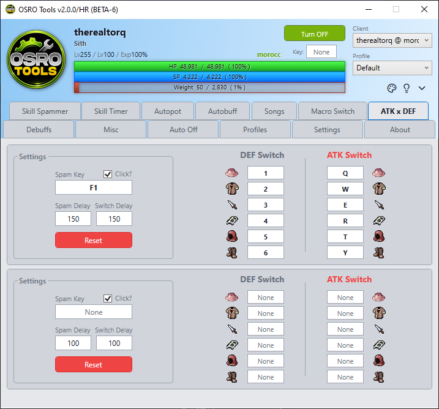

# ATK x DEF

The **ATK x DEF** tab allows you to configure an Attack gear set and a Defense gear set. You can quickly switch between them using a single hotkey. This is helpful for surviving large hits.

## 1. Equipment Slots
You can configure up to six equipment slots for both your **DEF Switch** and **ATK Switch**.

1. Put your individual armor and weapon pieces on your in-game hotbar.
2. Open the **ATK x DEF** tab in OSRO Tools.
3. Click the boxes under **DEF Switch** or **ATK Switch** to match the hotkeys you set in the game.
4. Leave a slot blank if you do not want to swap that piece of gear.

## 2. Trigger Settings
1. Click the box next to **Spam Key** and press the hotkey you want to use to trigger the swap.
2. Enter a **Switch Delay (ms)**. This is the delay between equipping each piece of gear. A longer delay prevents the game from ignoring rapid gear swaps.
3. Check the **Click** box if you want OSRO Tools to send a mouse click at the same time.

## 3. Tips
* If your gear swaps fail, increase the **Switch Delay** slightly until the server can process them properly.

