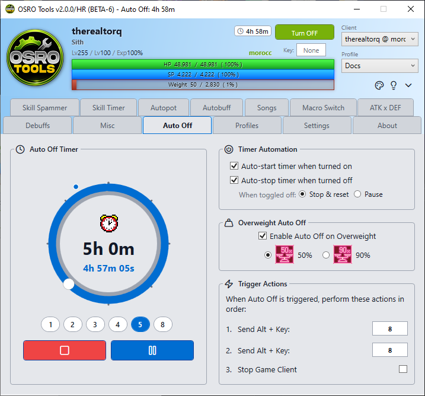

# Auto Off

The **Auto Off** tab helps you automatically pause your character, send in-game chat macros, or close the game when certain conditions are met.

## 1. Trigger Conditions
You can trigger the Auto Off macro based on two conditions:
* **Timer:** Set a countdown. When the time runs out, the macro triggers.
* **Overweight Limit:** The macro triggers when your character's weight reaches either 50% or 90%.

## 2. Using the Timer
The left side of the tab features a large timer dial. You must have the global OSRO Tools toggle turned **ON** before you can start the timer.
* **Setting the Time:** Drag the dial to set your desired duration, or click the **1h, 2h, 3h** quick buttons below the dial for easy setup.
* **Start / Pause:** Use the large **Start** and **Pause** buttons below the dial to manually control the countdown.

## 3. Timer Automation
The top right box allows you to automate the timer so you do not have to manually click the Start/Stop buttons every time.
* **Auto Start on Enable:** If checked, simply turning OSRO Tools ON globally will instantly start the countdown.
* **Auto Stop on Disable:** If checked, turning OSRO Tools OFF globally will halt the countdown.
* **Toggle Behavior:** If the above box is checked, you can choose whether turning OSRO Tools off should **Pause** the countdown (so it resumes where it left off) or completely **Stop** it (resetting it to your initially selected time).

## 4. Setup Instructions
1. Open the **Auto Off** tab in OSRO Tools.
2. Select your trigger condition (configure the Timer, or check the box under the Overweight Header and choose 50% or 90%).
3. Choose your actions on the right side of the screen.
4. To trigger an in-game chat macro, enter a number (0-9) into **Send Alt Key 1** or **Send Alt Key 2**.
5. To close the game entirely, check the box for **Stop Game Client**.

> **Note:** The **Send Alt Key** feature is specifically designed to trigger the built-in `Alt + 0-9` chat macros in the Ragnarok Online client (which you configure in-game by pressing `Alt + M`). A common use case is saving an `@aaoff` command to `Alt + 8` in the game, and putting `8` into OSRO Tools. This ensures your character automatically stops attacking and saves auto-attack time when the timer finishes.

