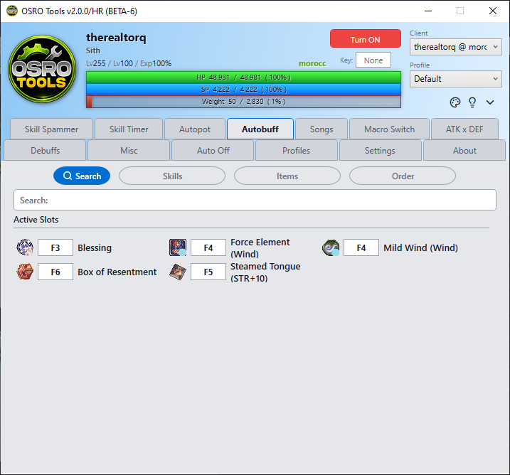

# Autobuff

The **Autobuff** tab ensures you never forget to use your buffs. It watches your character and recasts them exactly when they run out.

## 1. Smart Memory Reading
OSRO Tools reads the game memory to look at the buff icons on your screen. It only presses the buff key when the icon disappears. This saves your SP and items.

## 2. Setup Instructions
1. Put your buff skill or item on your in-game hotbar, like **F3**.
2. Open the **Autobuff** tab in OSRO Tools.
3. Click the **Search** sub-tab to find your buff quickly. You can also browse the **Skills** and **Items** sub-tabs manually.
4. Once you find the buff, type your hotkey (e.g., **F3**) into the box next to it.
5. Verify the buff is listed in the **Order** sub-tab.

Whenever that buff icon is missing from your character, OSRO Tools will press the key to apply it.

## 3. Tips
* Use the **Order** sub-tab to change which buff is cast first. This matters if multiple buffs run out at the exact same time.

