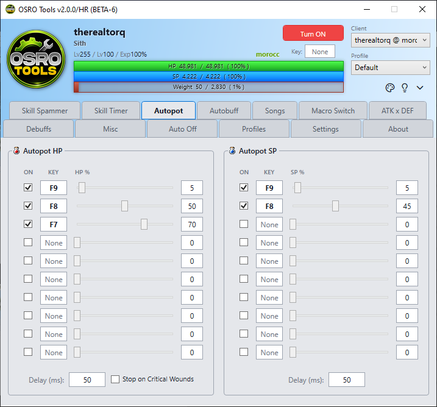

# Autopot (HP / SP)

The **Autopot** tab automatically presses potion hotkeys when your HP or SP drops below a certain amount. This keeps your character alive without manual button pressing.

## 1. How it Works
OSRO Tools does not use items from your inventory directly. You must place the potion on your in-game hotbar. OSRO Tools will then press that hotbar key for you.

## 2. Setup Instructions
1. Put your potion on a hotbar key in the game, like **F1**.
2. Open the **Autopot** tab in OSRO Tools.
3. Click the first key box and press **F1** on your keyboard.
4. Move the slider to set your HP limit. For example, set it to **70%**.
5. Check the box on the right to enable the row.

When your HP drops below 70%, OSRO Tools will rapidly press **F1** until you heal above 70%.

## 3. Tips
* You can configure multiple rows. For example, set a cheap potion to 80%, and a strong potion to 40% for emergencies.
* The SP section works the exact same way, but it monitors your blue SP bar.

