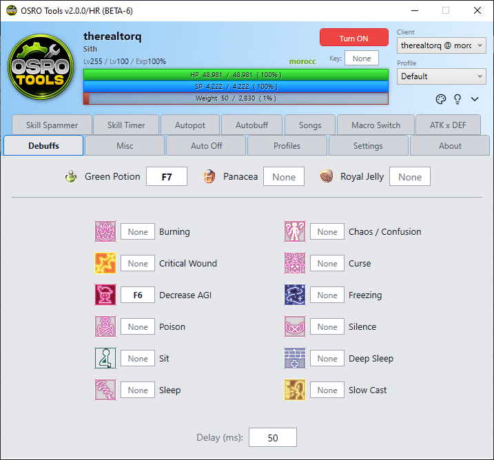

# Debuffs & Status Recovery

The **Debuffs** tab allows OSRO Tools to monitor your character's negative status effects. It will automatically press specific keys to cure them when detected.

## 1. Status Recovery Items
At the top of the tab, you can quickly configure automatic consumption of common cure items.

1. Open the **Debuffs** tab in OSRO Tools.
2. Put Panacea, Royal Jelly, or Green Potion on a hotkey in the game.
3. Click the box next to the item name and press the same key.
4. Check the enable box next to the key.

## 2. Debuff Grid
Below the items is a grid of specific debuffs like Silence, Curse, or Stun. You can assign a specific key for OSRO Tools to press when that debuff happens. This is useful for using specialized cure skills or items on yourself.

1. Find the specific debuff in the grid.
2. Click the box next to it and press your cure hotkey.
3. Check the enable box.

## 3. Tips
* OSRO Tools will only press the cure key once when the debuff starts.

