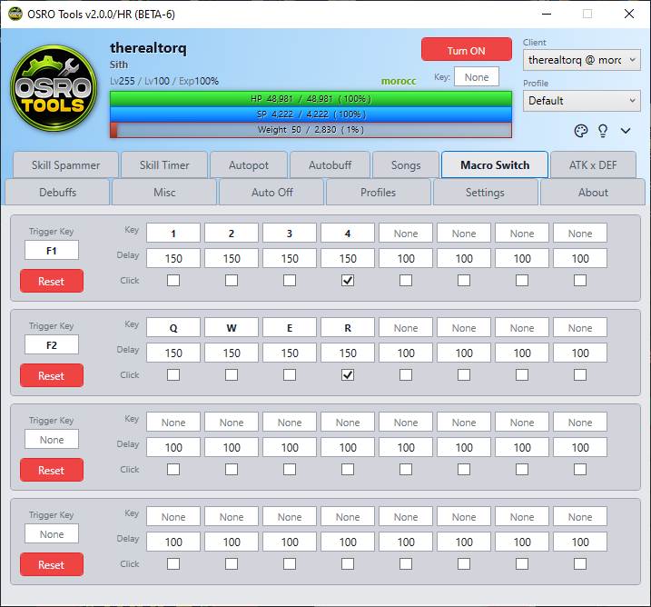

# Macro Switch

The **Macro Switch** tab lets you build custom multi-step sequences that activate with a single button press.

## 1. Trigger Configuration
You can create multiple macro rows. The left side controls how the macro starts.

1. Open the **Macro Switch** tab in OSRO Tools.
2. Click the box under **Trigger Key** and press your desired hotkey.

## 2. Step Configuration
The right side controls what the macro actually does. It will run the steps in order from left to right.

1. Click the **Key** box in the first step and assign a hotkey.
2. Enter a **Delay** in milliseconds. This tells the macro how long to wait before running the next step.
3. Check the **Click** box if you want the macro to send a mouse click during this step.
4. Repeat for the remaining steps.

## 3. Tips
* To add more visible steps or rows, change the rows configuration in the **Settings** tab.

