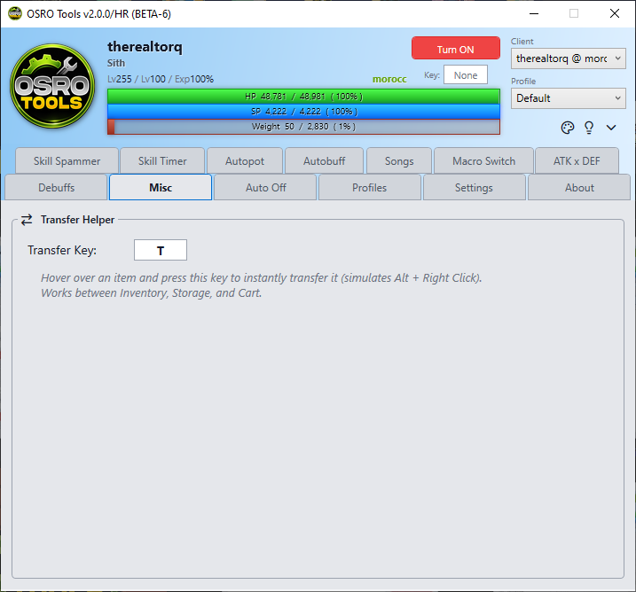

# Misc

The **Misc** tab contains standalone tools and quality-of-life improvements that do not fit into the standard combat tabs.

## 1. Transfer Helper
The Transfer Helper is a tool designed to quickly move hundreds of items between your inventory and storage. In the game, moving an item fast requires holding Alt and Right-Clicking. The Transfer Helper automates this action.

## 2. Setup Instructions
1. Open the **Misc** tab in OSRO Tools.
2. Click the box next to **Transfer Key** and press a key on your keyboard.
3. Go back to the game and point your mouse cursor at an item you want to move.
4. Press and hold your chosen **Transfer Key**.

OSRO Tools will simulate an extremely fast Alt + Right-Click combo while you hold the key, sending the items instantly.

## 3. Tips
* This feature helps prevent hand strain. Simply hold the key and drag your mouse over your inventory to move everything rapidly.

