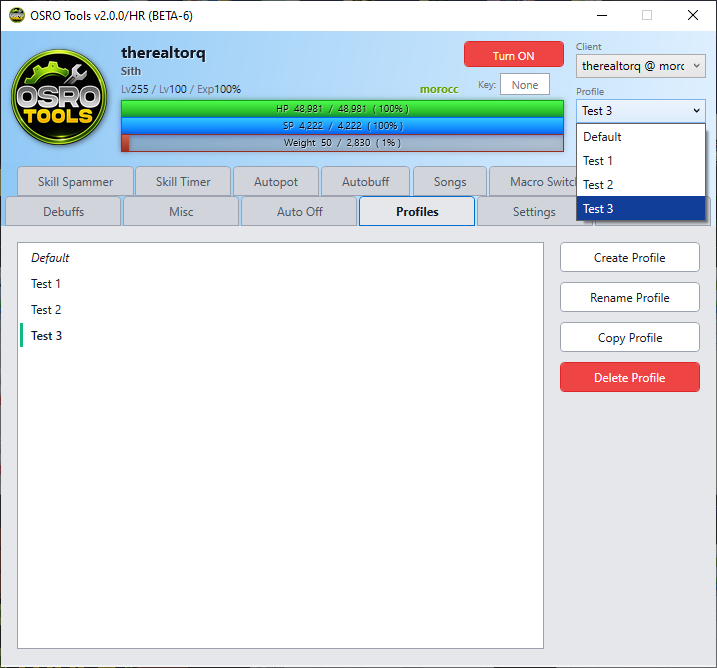

# Profiles

The **Profiles** tab helps you manage all your saved configurations. You can create different setups for different characters and instantly load them.

## 1. Managing Profiles
1. Open the **Profiles** tab in OSRO Tools.
2. Type a new name into the box and click **Save** to create a profile.
3. Select a name from the dropdown list and click **Load** to restore those settings.
4. Click **Delete** to remove the selected profile.

## 2. Quick Swapping
You do not need to open the main window to switch profiles.

1. Right-click the OSRO Tools icon in your Windows system tray.
2. Select your desired profile from the context menu to instantly load it.

## 3. Tips
* You can quickly load a profile while in the **Profiles** tab by simply double-clicking its name in the list.
* Changes made to the **Per-Profile** section in the **Settings** tab are saved to your active profile. Interface settings apply globally to the whole app.

