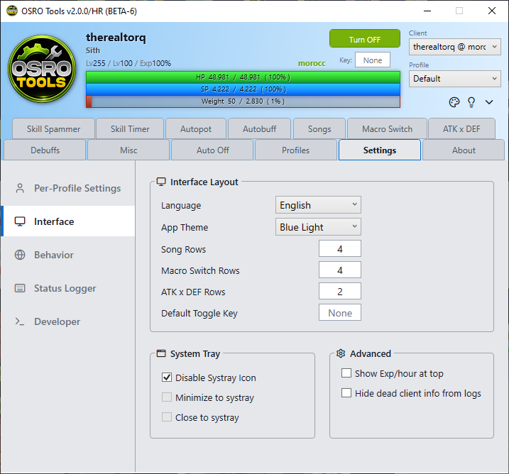

# Settings

The **Settings** tab contains global configuration options for OSRO Tools. Use the sidebar menu to navigate between categories.

## 1. Per-Profile Settings
These options are tied to your currently active profile.

* **Pause In Town:** Automatically pauses all macros and autopot functions when your character enters a town map.
* **Sounds On:** Toggles notification sounds for the profile.

## 2. Interface Settings
* **Language:** Change the display language.
* **App Theme:** Switch between Light and Dark mode.
* **Rows Configuration:** Adjust the number of visible rows in the **Songs**, **Macro Switch**, and **ATK x DEF** tabs.
* **Default Toggle Key:** Sets the default hotkey that will be automatically assigned to start and stop OSRO Tools whenever you create a brand new profile. (To change the hotkey for your *current* profile, edit the key box directly on the main top panel).

## 3. System Tray Settings
* **Disable Systray:** Hides the system tray icon entirely.
* **Minimize to Systray:** Hides the window in the system tray when minimized.
* **Close to Systray:** Hides the window in the system tray when closed. You must right-click the tray icon to fully exit.

## 4. Behavior & Advanced Settings
* **Pause When Chatting:** Pauses all macros when your game chat box is active. This stops you from accidentally typing macro keys into chat.
* **Pause When Dead:** Halts all activity if your character dies.
* **Show Exp Per Hour:** Adds a live experience tracker below your character name on the main panel.
* **Keep Dead Client Info:** Prevents the UI from clearing character data if the game client disconnects.

## 5. Tips
* If you want to check your active buffs for troubleshooting, open the **Status Logger** tab to see raw status data.

