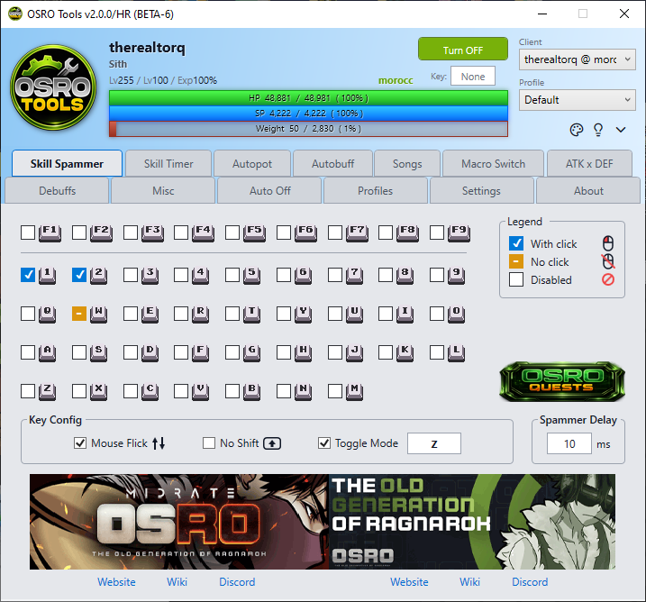

# Skill Spammer

The **Skill Spammer** tab allows you to rapidly use skills while holding or toggling a hotkey.

## 1. Key Grid Configuration
The main area is a grid of checkboxes that match your keyboard layout. Each checkbox has three states that change when you click it.

* **Disabled (Empty box):** The key will not be spammed.
* **With Click (White checkmark in a blue box):** OSRO Tools will press the key and also send a mouse click at your cursor's location. This is for targeted ground skills.
* **No Click (White dash in an orange box):** OSRO Tools will press the key but will not send a mouse click. This is for instant self-buffs.

## 2. Setup Instructions
1. Open the **Skill Spammer** tab in OSRO Tools.
2. Find the key you want to spam on the grid.
3. Click the checkbox until it shows the correct state for your skill (With Click or No Click).
4. In the bottom panel, enter your desired **Spammer Delay (ms)**. Lower values will try to spam faster, but the actual speed is limited by your server's ping and built-in skill delays.
5. In the game, press and hold the key to start spamming.

## 3. Tips
* Check **Mouse Flick** to snap your cursor during clicks. This can help bypass certain skill animations.
* Check **No Shift** to prevent the Shift key from interfering during the spamming process.
* Use **Toggle Mode** if you prefer to press the key once to start spamming, and press it again to stop.

