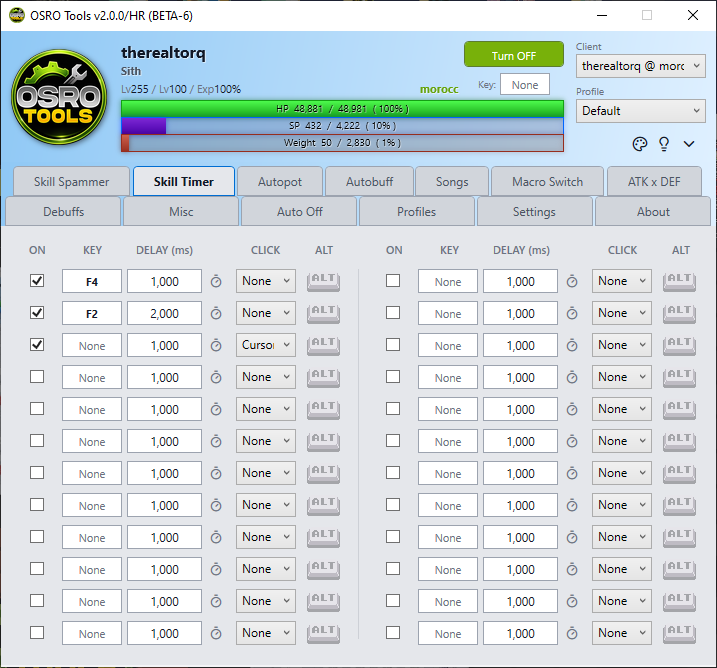

# Skill Timer

The **Skill Timer** tab allows you to automatically use specific skills or items at regular intervals. This is ideal for maintaining long buffs.

## 1. Slot Configuration
You have 24 separate slots to use. For each slot, you can set the hotkey and the time delay between presses.

## 2. Setup Instructions
1. Open the **Skill Timer** tab in OSRO Tools.
2. Click the box under **Key** and press the hotkey for your skill.
3. Check the **Alt** box if the skill requires holding the Alt key in the game.
4. Enter the **Delay (ms)**. This is the time in milliseconds to wait before pressing the key again. Alternatively, click the clock icon next to the delay box to open a dialog where you can easily set the timer using minutes and seconds.
5. Select a click mode from the dropdown list.
   * **Click None:** Presses the key only.
   * **Click Cursor:** Presses the key, then clicks wherever your mouse cursor is located.
   * **Click Center:** Presses the key, then clicks in the exact center of the game window.
6. Check the box on the far left to enable the timer.

> **Note:** If a buff lasts 60 seconds, clicking the clock icon and setting the time to 59 seconds is the easiest way to ensure it stays active without gaps.

## 3. Tips
* The timer will only run if your global OSRO Tools toggle is currently active.

