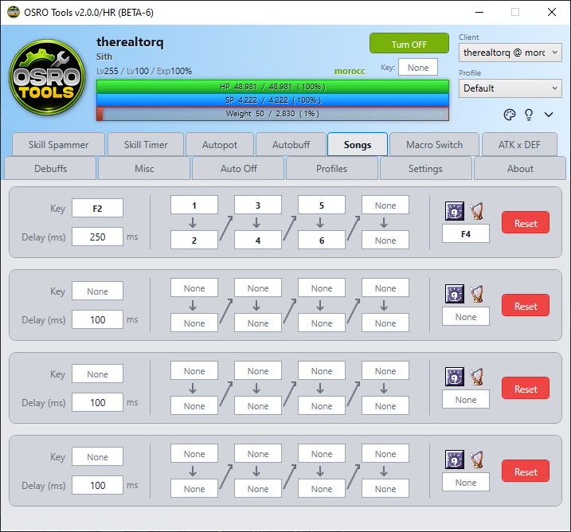

# Songs

The **Songs** tab automates weapon swapping and zigzag sequences for Bard and Dancer classes.

## 1. The ZigZag Sequence
The middle of the row is an 8-step zigzag grid. This is the sequence of keys OSRO Tools will press rapidly to perform a skill, swap weapons, and cancel the animation.

1. Open the **Songs** tab in OSRO Tools.
2. Click the boxes in the zigzag grid (Step 1 through 8) to set the hotkeys for your specific sequence.
3. Leave unused steps blank.

## 2. Trigger and Keys
1. Set the **Key** on the left side to choose the hotkey that starts this sequence.
2. Enter a **Delay (ms)** to control the speed of the steps.
3. Set your **Instrument** hotkey on the right side.
4. Set your **Adaptation** skill hotkey next to it.

> **Note:** Providing your Instrument and Adaptation hotkeys allows the macro to reset your character properly if interrupted.

## 3. Tips
* Adjust the **Delay** based on your connection ping to make the animation canceling as fast as possible.

