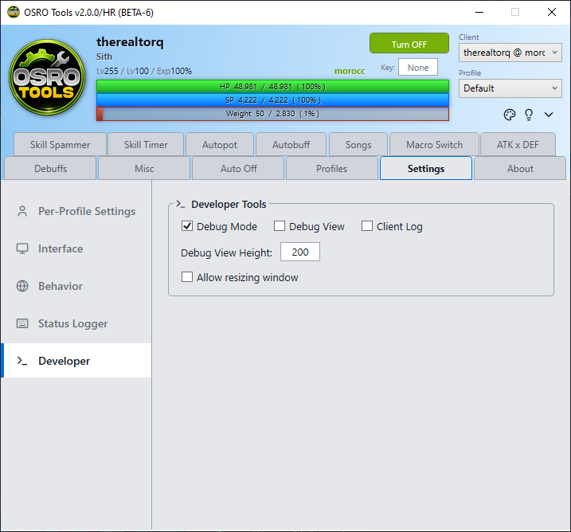

# Troubleshooting

Sometimes OSRO Tools might not work perfectly. Here is how to solve the most common problems.

## 1. Antivirus or Windows Defender Warnings
Because OSRO Tools reads memory and sends automated keyboard presses, your Antivirus or Windows Defender might think it is a virus. This is a "false positive."
- **How to fix:** You must add the OSRO Tools folder to your Antivirus exceptions or allow list.

## 2. Hotkeys Are Not Pressing in Game
If the app sees your HP go down, but your character does not drink a potion:
- Ensure the key you put in OSRO Tools matches the exact key on your in-game hotbar.
- Ensure you have the actual item in your inventory.
- Ensure you are running OSRO Tools as Administrator, otherwise Windows blocks the fake key presses.

## 3. App Closes by Itself Randomly
If the app or the game closes by itself while you are playing, check the **Auto Off** tab. You might have left a time limit or a weight limit turned on by accident.

## 4. App Does Not Read HP/SP (Shows 0 / 0)
OSRO Tools reads the game memory to know your health. If your HP and SP at the top of the app show as `0 / 0`, it means OSRO Tools cannot find your game client.
- **Not Running as Admin:** If you forgot to run OSRO Tools as Administrator, it cannot read the memory.

## 5. Reporting Bugs
If you are still having issues and need to report a bug, you can generate a log file to help the developers fix it.

1. Open the **Settings** tab.
2. Go to the **Developer** sub-tab on the left.
3. Check the box for **Debug Mode** (you do not need to enable Debug View).
4. Run OSRO Tools again and try to make the bug happen.
5. Provide the generated log file when you report the issue in the community Discord (https://discord.com/invite/osro).

